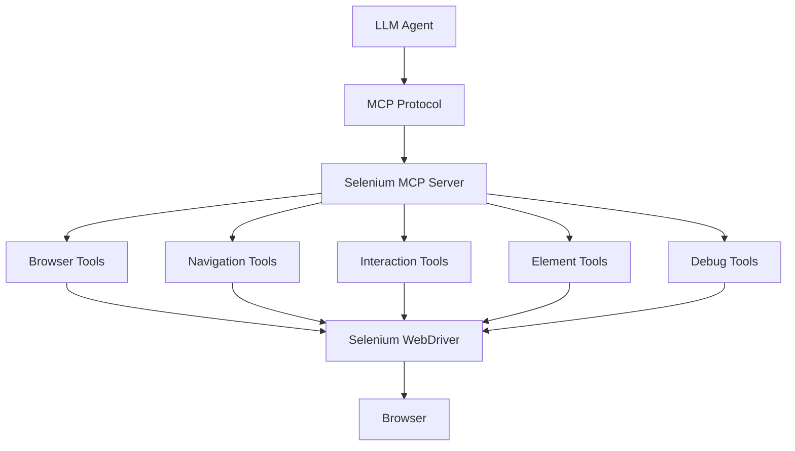

# selenium-mcp-server


Selenium WebDriver MCP server that enables LLMs & AI agents to control real browsers using Selenium and MCP.

This project exposes Selenium WebDriver as an MCP (Model Context Protocol) server, allowing AI agents to control a real browser through structured tools.

It enables LLMs and autonomous agents to perform tasks like:

- Opening browsers
- Navigating websites
- Discovering UI elements
- Clicking buttons and links
- Typing into inputs
- Extracting page text
- Taking screenshots
- Many more future upgrades (in-progress)

This makes it possible to build AI-powered browser automation systems and autonomous QA agents.

## WHY THIS PROJECT EXISTS

Modern AI agents need a way to interact with real applications.

While traditional automation tools like Selenium exist, they are not directly usable by LLM agents.

This project bridges that gap by exposing Selenium functionality through MCP tools so that agents can:

- Understand web pages
- Discover UI elements
- Perform actions
- Validate results

## ARCHITECTURE



## FEATURES

- MCP-compatible Selenium automation server
- Browser session management
- Navigation controls
- UI element discovery
- Accessibility-aware interaction
- Screenshot capture
- Page text extraction
- Headless browser support

## INSTALLATION

### Run the following command

```bash
pip install selenium-mcp
```

## RUNNING THE SERVER

#### Start the MCP server
```bash
selenium-mcp run
```
This launches the Selenium MCP server and exposes browser automation tools to AI agents.

## TESTING THE SERVER
Run the following command to verify that the MCP server is running correctly:
```bash
selenium-mcp check 
```
This script checks whether the Selenium MCP server is initialized successfully and whether the required tools are available.

If the server is set up correctly, you should see the following message in the terminal:

```bash
MCP Server sanity check passed
```

If the setup fails, the terminal will display an error message indicating that the sanity check did not pass.

## BROWSER SESSION FLOW

Each browser session is identified by a `session_id`.

### Typical workflow for agents:
1. open_browser
2. open_url
3. wait_for_page
4. get_interactive_elements
5. click_element or type_into_element

## AVAILABLE MCP TOOLS
### BROWSER CONTROL
1. `open_browser` – Launch a new browser session  
2. `close_browser` – Close the browser session  
3. `maximize_browser` – Maximize browser window  
4. `fullscreen_browser` – Switch browser to fullscreen  

### NAVIGATION
1. `open_url` – Navigate to a specific URL  
2. `navigate_back` – Navigate back in browser history  
3. `navigate_forward` – Navigate forward in history  
4. `refresh_page` – Reload the page  
5. `wait_for_page` – Wait for page to load  
6. `get_page_title` – Get the current page title  

### ELEMENT DISCOVERY
1. `get_interactive_elements` – Discover visible interactive elements on the page  
2. `get_accessibility_tree` – Retrieve simplified accessibility tree for the page  

These tools allow agents to understand the UI structure before interacting with it.

### INTERACTION TOOLS
1. `click_element` – Click an element by index  
2. `type_into_element` – Enter text into an input field  

Elements must first be discovered using: `get_interactive_elements`

### PAGE ANALYSIS
`get_page_text` – Extract visible text from the page

Useful for:
- validation
- reasoning
- information extraction

### VISUAL DEBUGGING
`take_screenshot` – Capture a screenshot of the current browser window

#### Screenshot Storage Location
When screenshots are captured, they are automatically saved in a hidden folder inside your home directory.

##### macOS / Linux
Screenshots are stored at:
```
~/.selenium-mcp/screenshot
```

Example full path:
```
/Users/<your-username>/.selenium-mcp/screenshot
```

You can open the folder using Terminal:
```bash
open ~/.selenium-mcp/screenshot
```

##### Windows

Screenshots are stored at:
```
C:\Users\<your-username>\.selenium-mcp\screenshot
```

Example:
```
C:\Users\John\.selenium-mcp\screenshot
```

You can open it from **File Explorer** by entering the following in the address bar:
```
%USERPROFILE%\.selenium-mcp\screenshot
```
#### Custom Screenshot Directory (Optional)

You can override the default screenshot location using the environment variable: `SELENIUM_MCP_SCREENSHOT_DIR`

##### macOS / Linux
```bash
export SELENIUM_MCP_SCREENSHOT_DIR=~/my-screenshots
```

##### Windows (PowerShell)
```bash
$env:SELENIUM_MCP_SCREENSHOT_DIR="C:\my-screenshots"
```

All screenshots will then be saved to the specified directory.

##### Notes

* The folder is **created automatically** the first time a screenshot is taken.
* The `.selenium-mcp` directory is **hidden by default** because it starts with a dot (`.`).
* You can safely delete screenshots anytime.

## EXAMPLE AGENT WORKFLOW

### Example task: 
Search Google for "Selenium MCP"

#### Agent steps:
```python
open_browser

open_url("https://google.com")

wait_for_page

get_interactive_elements

type_into_element(index, "Selenium MCP")

click_element(index)

wait_for_page

get_page_text
```
## SYSTEM PROMPT FOR AI AGENTS

This repository includes a **production-grade system prompt** designed specifically for browser automation agents that interact with this Selenium MCP server.

The prompt contains detailed operational guidelines that instruct the AI agent on how to:

* initialize and control the browser
* discover and interact with UI elements
* analyze page structure using the accessibility tree
* avoid hallucinating element indexes
* handle navigation and page reloads
* recover from stale elements
* follow a deterministic execution loop (PLAN → ACT → OBSERVE → UPDATE PLAN)
* enforce safety limits on tool usage

### Prompt location
```
prompts/system_prompt.md
```

### How to use

Whenever you build an AI agent that interacts with this MCP server, **this prompt should be provided as the system prompt** for the model.


### Why this prompt

Browser automation agents can easily make incorrect decisions if not guided properly.
This system prompt provides **strict operational rules and guardrails** that help the agent:

* use MCP tools correctly
* avoid incorrect element interactions
* minimize hallucinations
* perform reliable browser automation tasks

Using this prompt significantly improves the **stability, accuracy, and reliability** of AI-driven browser automation.

### Recommendation

It is strongly recommended that **all AI agents interacting with this Selenium MCP server use this system prompt** to ensure consistent and reliable behavior.

## PROMPT CUSTOMIZATION

You may modify or extend the system prompt depending on your use case. However, it is recommended to preserve the core operational rules related to:

* MCP tool usage
* element discovery
* navigation handling
* safety limits

## LOGGING
All application logs are stored in a user-specific directory:
```bash
~/.selenium-mcp/logs/
```
This directory is automatically created when the server starts.

### Log file
Logs are written to:
```bash
~/.selenium-mcp/logs/selenium_mcp.log
```

Features:
* Daily log file rotation
* Automatic cleanup of older log files
* Logs written to both console and file
* Persistent logs independent of the project directory

Logs are stored in the user's home directory so they remain available even if the package is installed globally via pip. This makes it easier to debug issues and monitor MCP server activity across different projects.

### Example Log Entry
```bash
2026-03-15 19:00:07,444 [INFO] [selenium-mcp] Initializing Selenium MCP Server...
```

#### macOS / Linux
Logs are stored in:
```bash
/Users/<username>/.selenium-mcp/logs/
```
Example:
```bash
/Users/john/.selenium-mcp/logs/selenium_mcp.log
```
You can open it from the terminal:
```bash
cd ~/.selenium-mcp/logs
ls
```

View logs:
```bash
cat selenium_mcp.log
```
or
```bash
tail -f selenium_mcp.log
```

#### Windows
Logs are stored in:
```bash
C:\Users\<username>\.selenium-mcp\logs\
```
Example:
```bash
C:\Users\John\.selenium-mcp\logs\selenium_mcp.log
```

Open it in File Explorer:
```bash
C:\Users\%USERNAME%\.selenium-mcp\logs\
```

Or from Command Prompt:
```bash
cd %USERPROFILE%\.selenium-mcp\logs
dir
```

## REQUIREMENTS
* Python 3.10+
* Selenium
* Web browser
* webdriver-manager
* MCP Python SDK

## USE CASES

This project can be used to build:
* AI test automation agents
* Autonomous QA assistants
* LLM-powered browser copilots
* Self-healing test frameworks
* AI web scraping agents
* Intelligent UI testing systems

## CONTRIBUTING

Contributions are welcome.

### Steps:
1. Fork the repository
2. Create a feature branch
3. Submit a pull request

## LICENSE
MIT License

## AUTHOR

Prashant Nayak

🔗 LinkedIn: https://www.linkedin.com/in/prashantjnayak

Built to help the QA and AI automation community build intelligent browser automation systems.

## SUPPORT THE PROJECT

If this project helps you:
* Star the repository
* Share it with the QA community
